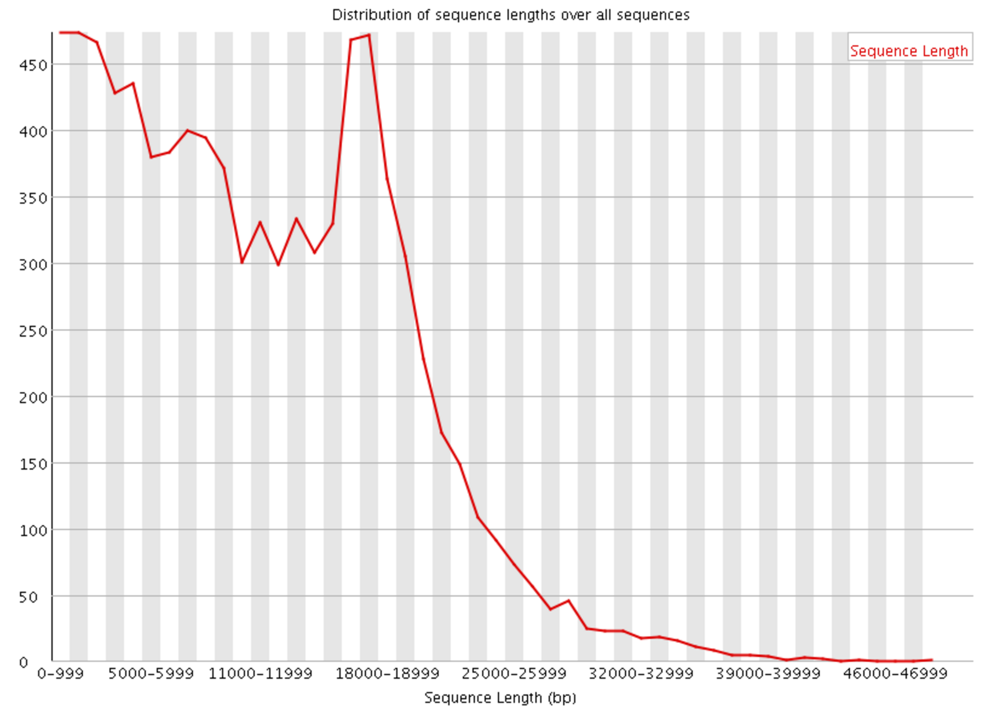
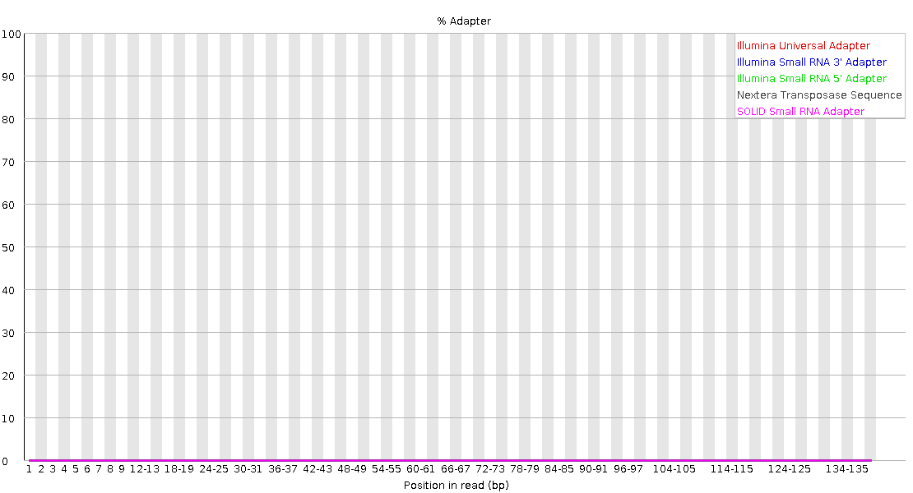

# AMNH NGS Workshop

Welcome to the NGS workshop at the AMNH.

My info: Dean Bobo  deanbobo@gmail.com or dbobo@amnh.org

#### Important links:

Presentation slide deck: https://drive.google.com/file/d/1-Y2Jl8udzgbUKKQMBT_x4hvQyHroUrSx/view?usp=sharing
Note: slides are also in the github as a PowerPoint file.

VM setup instructions: https://docs.google.com/document/d/1hiZhezlBl6asGqycsHOuTHkbIcBSptk_X7G1G6erQLw/edit?usp=sharing

FASTQ files in dropbox: https://www.dropbox.com/sh/dbrmh6umigxcuxq/AAAB7Uup69tJWstq5AKx-vAna?dl=0

#### Overview

* [1. About Sequencing and FASTQs](#section-1-about-sequencing-and-fastqs)

* [2. Start Virtual Machine and Download FASTQ files](#section-2-start-the-virtual-machine-and-download-fastq-files)
* [3. About Sequencing Quality Control](#section-3-about-sequencing-quality-control-qc)
* [4. Evaluate Data Quality](#section-4-evalute-data-quality)
* [5. Read Trimming](#section-5-read-trimming)
* [6. Adapter Removal](#section-6-adapter-removal)
* [7. Read Alignment](#section-7-read-alignment)

## Section 1: About Sequencing and FASTQs

#### The FASTQ file

* The FASTQ format is the de facto standard by which many sequencing instruments represent data. 
* It may be thought of as a variant of the FASTA format that allows it to associate a quality measure to each sequence base, FASTA with QUALITIES.

* Each read in the FASTQ has 4 sections (usually a single line for each):
  1. A FASTA-like header.  Starts with @ symbol. This is followed by an ID and more optional text
  2. Sequence (typically on a single line), but it may be wrapped until the + sign starts the next section.
  3. Quality Score Identifier: marked by the + sign and may be optionally followed by the same sequence id and header as the first section (but is often blank)
  4. Quality Score Values for the sequence in section 2, and must be of the same length as section 2. It should (must?) also be wrapped the same way as the section 2.

  Example FASTQ read:
    ```
    @GWNJ-0957:537:GW2001112798th:6:1101:5051:1379 2:N:0:GTAAGGTG+GCAATTCG
    GAAAGTCTTCTTTCTTTTTTCTCTGATCTTGAACATCATTTTCAAATAAGGTTACATTATTTGAGTTAAGA
    +
    AAAAFF--AA-AF--7A-<-AJJFJFJ<JJJFFFF<FAFJJJFJJFJFA-<----<FF--7--<-F7JFFF
    ```

* FASTQ Quality scores have "encoded" numerical values
* each character represents a Phred score (see below)

  ```
  !"#$%&'()*+,-./0123456789:;<=>?@ABCDEFGHI
  |    |    |    |    |    |    |    |    |
  0....5...10...15...20...25...30...35...40
  |    |    |    |    |    |    |    |    |
  worst................................best
  ```
* A Phred score Q is used to compute the probability of a base call being incorrect by the formula: ``` P=10^(-Q/10). ```

  | Q | Error | Accuracy |
  | --- | --- | --- |
  | 0 | 1 in 1 | 0% |
  | 10 | 1 in 10 | 90 % |
  | 20 | 1 in 100 | 99 % |
  | 30 | 1 in 1000 | 99.9% |
  | 40 | 1 in 10,000 | 99.99% |

* Are FASTQ errors accurate? Not really.

  > In our observation the numbers are quite unreliable - treat them as an advisory rather than accurate measurements.”
  > -BioStarHandbook 2020

  * Paired end FASTQ files: Two files. One file has forward reads. Second file has reverse reads.

#### Paired-End Sequencing

* Paired end sequencing enables both ends of the DNA fragment to be sequenced.
* Since paired end distances are known, alignment algorithms can use this information to map the reads over repetitive regions more precisely.


## Section 2. Start the Virtual machine and download FASTQ files
  1. Open the VirtualBox program and download FASTQ files 
    * Setup instructions are here: tinyurl.com/tad77jp

  2. Download your FASTQ files to the virtual machine. Take note where the sequencing data is downloaded. Firefox will put it in ```~/Downloads```

  3. move to your home directory and clone this git repository (we will work inside this git repository)  

      ```cd ~```   
      ```git clone https://github.com/deanbobo/amnh-ngs-workshop.git```

     * This will create a directory called amnh-ngs-workshop in your home directory. We will work inside this folder.

  4. Move FASTQ files to this new directory:   

     ```mv ~/Downloads/*.fastq.gz ~/amnh-ngs-workshop/```  
     * mv command moves or renames files  
     * \* is the wildcard in linux

     * confirm file is moved with the ```ls``` command:  

       ```ls -ltrh ```  

        * ``ls`` command shows a list of files. The switches:
          * ``l`` shows the long format  
          * ``t`` sorts by time  
          * ``r`` reverses the sort so most recent files are at bottom of the list (easier to work this way)  
          * ``h`` makes file sizes human readable  

   * SOME LINUX TIPS: 
      1. use the up arrow on your keyboard to bring up previous commands. You can edit and rerun the commands as needed.
      2. Use the tab key to autocomplete commands and files and paths
      3. Linux does not care about filename suffixes. A compressed file can live with the name file.R1.fq OR file.R1.fq.gz OR file.R1.anything. Linux **does not care**.
      4. A great way to know for sure what the file type is, is to use the ```file``` command. Example:  

        ```file MY_FILENAME_HERE```  

  5. Look at the FASTQ file with ``less``

   * ```less``` can often look at compressed data without any other tools (not true for BAM files)  

     ```less MY_FILENAME_HERE```  
     ```less Picon-19C-AC05_R1_001.fastq.gz```  

  * if you do not want the text to wrap, use the ```-S``` switch.  

    ```less -S MY_FILENAME_HERE```

6. Count the number of reads in each FASTQ file.   

  ```echo $(zcat MY_FILENAME_HERE.R1.fastq.gz | wc -l)/4|bc```
  ```echo $(zcat MY_FILENAME_HERE.R2.fastq.gz | wc -l)/4|bc```

## Section 3: About Sequencing Quality Control (QC)

* Quality control (QC) is the process of improving data by removing identifiable errors from it. 
* It is typically the first step performed after data acquisition.
* It is common to expect too much from quality control. Remember that QC cannot turn bad data into useful data and we can never salvage what appears to be a total loss.

* Is QC important?
  * The more unknowns about the genome under study, the more critical it is to correct any errors.
  * When aligning against well-studied and known genomes, we can recognize and identify errors by their alignments. When assembling a de novo genome, mistakes can derail the process; hence, it is more important to apply a higher stringency for filtering.

* QC typically follows this process:
  1. Evaluate (visualize) data quality
  2. Stop and move to next analysis step if the quality appears to be satisfactory.
  3. If not, execute one or more data altering steps, then go to step 1.

## Section 4: Evalute Data Quality 
  * There are many tools to evaluate (and visualize) data quality, but here we will use FastQC - probably the most popular tool. Generate the fastqc plots with this command:  

    ```fastqc MY_FORWARD_FASTQ_FILE_HERE MY_REVERSE_FASTQ_FILE_HERE```

  * List the files  

    ```ls -ltrh```  
    * notice the html files generate  

  * open the files with firefox. We can do this directly from the command line.  

    ```firefox forward_fastq_file_here```  
    ```firefox reverse_fastq_file_here```  

  * FastQC generates a summary report. With symbols/icons for each analysis 
    * Green check mark = Pass
    * Yellow exclamation point = Warn
    * Red X = Fail/Error

  * Should I be worried about the red X error symbols?
    * Not unless all or most of the tests are failing. Most of the time, these symbols are not meaningful. They were developed for paticular libraries and sequencing instruments. Your samples are probably different. It is better to interpret the analyses yourself. This requires an understanding of each plot.

#### Quality Scores Across All Bases  
* The simplest way to snapshot the quality of a sequencing run is via a chart that plots the error likelihood at each position averaged over all measurements.  


* You will likely notice decreased quality scores towards tails of reads. This is due to phasing. Phasing means that the blocker of a nucleotide is not correctly removed after signal detection.


* Molecule 3 on the right is one cycle behind the rest and will pollute the light emitted from the cluster.

* Reverse reads will also likely be lower quality than forward reads. 

#### Sequence Length  

* The sequence length distribution shows how many sequences of each length the data contains.  
* For fixed read length instruments (Illumina sequencer), all read lengths are the same.  
* For long read technologies like the PacBio and MinION, the distribution can be a lot more varied.  


#### Other QC Tools
* A considerable number of QC tools have been published. Some widely used, recommended tools include: Trimmomatic, BBDuk ,flexbar and cutadapt.  

* Others in alphabetical order:
  * BBDuk part of the BBMap package
  * BioPieces a suite of programs for sequence preprocessing
  * CutAdapt application note in Embnet Journal, 2011
  * fastq-mcf published in The Open Bioinformatics Journal, 2013
  * Fastx Toolkit: collection of command line tools for Short-Reads FASTA/FASTQ files preprocessing - one of the first tools
  * FlexBar, Flexible barcode and adapter removal published in Biology, 2012
  * NGS Toolkit published in Plos One, 2012
  * PrinSeq application note in Bioinformatics, 2011
  * Scythe a bayesian adaptor trimmer
  * SeqPrep - a tool for stripping adaptors and/or merging paired reads with overlap into single reads.
  * Skewer: a fast and accurate adapter trimmer for next-generation sequencing paired-end reads.
  * TagCleaner published in BMC Bioinformatics, 2010
  * TagDust published in Bioinformatics, 2009
  * Trim Galore - a wrapper tool around Cutadapt and FastQC to consistently apply quality and adapter trimming to FastQ files, with some extra functionality for MspI-digested RRBS-type (Reduced Representation Bisufite-Seq) libraries
  * Trimmomatic application note in Nucleic Acid Research, 2012, web server issue.

## Section 5: Read Trimming  

* We will use Trimmomatic to do dynamic trimming. We'll use a sliding window (size = 4 bp). If the quality score for the 4 bases is < 20, the read gets chomped. So after this step, reads will all not be the same length. 
* IMPORTANT: The window size and quality thresholds in this example are not standard practice. This is an example. you have to decide what quality thresholds are appropriate for your project. 
  * Note: In the example (pseudocode) below, you have to replace anything inside square brackets [ ]. The backslashes "escape" the hard return. You'll see that in many bash examples.
  * Another note: The trimmomatic command is order sensitive. The order of input/output files matters. Follow this psudocode as a guide:  

  ```
  TrimmomaticPE \
  [input_forward] \
  [input_reverse] \
  [ouput_forward_trimmed] \
  [output_forward_unpaired] \
  [output_reverse_trimmed] \
  [output_reverse_unpaired] \
  SLIDINGWINDOW:4:20
  ```  

  Run Trimmomatic. Here is an example of a working Trimmomatic command:

    ```
    TrimmomaticPE  Groth-07C-JG2_R1_001.fastq.gz Groth-07C-JG2_R2_001.fastq.gz Groth-07C-JG2_R1_001_trimmed.fastq.gz Groth-07C-JG2_R1_unpaired.fastq.gz Groth-07C-JG2_R2_001_trimmed.fastq.gz Groth-07C-JG2_R2_001_unpaired.fastq.gz SLIDINGWINDOW:4:20
    ```

  Before trimmomatic:
    

  After trimmomatic:
  

  * As you can see from the before and after plots, trimmomatic removed parts of reads where quality was low. The average quality score at each position improvement is reflected in the second "After trimmomatic" plot. **AGAIN: this filter may be entirely too aggressive for your purposes.**

## Section 6: Adapter Removal

  * FastQC detected cases of Illumina universal adapter in this example.  
  * We will use the program ```cutadapt``` to remove adapters. 

  Before adapter removal:
   

  Example of cutadapt: 

  ```cutadapt -a AGATCGGAAGAG \            #Illumina universal adapter
  -o R1.trimmed.cutadapt.fastq.gz \     #output  forward
  -p R2.trimmed.cutadapt.fastq.gz \     #output reverse
  in.R1.trimmed.fastq.gz \              #input forward
  in.R2.trimmed.fastq.gz                #input reverse
  ```   

  Here is a working code example:
  ```
  cutadapt -a AGATCGGAAGAG -o Groth-07C-JG2_R1_001_trimmed.cutadapt.fastq.gz -p Groth-07C-JG2_R2_001_trimmed.cutadapt.fastq.gz Groth-07C-JG2_R1_001_trimmed.fastq.gz Groth-07C-JG2_R2_001_trimmed.fastq.gz  
  ```

  * You can run ```fastqc``` after running cutadapt and compare the plots before and after adapter removal.  

  Plot of adapters after running cut adapt:  
    

  It is very easy to see that the adapters are removed before the before and after plot.  

## Section 7: Read Alignment  
  * A reference genome is in fasta format.  
  * The reads from short read sequencing are aligned with a program like BWA or BowTie. Here we will use BWA.  
  * The alignment file is a SAM file (BAM is simply the compressed [binary] version of a SAM file).  
  * SAM files are tab delimited text files.  
    * Each row represents a single read.  
    * Each column has information about that read.  
  * More information about SAM format: https://samtools.github.io/hts-specs/SAMv1.pdf  

  #### Indexing the reference genome  
  1. Decompress the reference genome  
  ```gunzip canFam3.1.MT.fa.gz```  

  2. Create a BWA index file  
  ```bwa index canFam3.1.MT.fa```  

  3. Create a SAMTOOLS index file  
  ```samtools faidx canFam3.1.MT.fa```  

  4. Create a sequence dictionary with Picard  
  ```picard-tools CreateSequenceDictionary R=canFam3.1.MT.fa O=canFam3.1.MT.dict```  

  NOTE: picard-tools may not be installed. If that is the case, install it with this command:  
  ```sudo apt install picard-tools```  
  You'll need to type in the password. No characters will appear when you type in the password.  

  #### Mapping Reads  

  5. Map the reads with BWA.  
  ```bwa mem –R '@RG\tID:coyote\tSM:coyote\tLB:coyote\tPL:Illumina' canFam3.1.MT.fa coyote.R1.MT.fq.gz coyote.R2.MT.fq.gz -t 2 | samtools view -bS - > coyote.MT.bam```  

  6. Sort the BAM. (sorts by coordinates)  
  ```samtools sort -o coyote.MT.sorted.bam coyote.MT.bam```  

  7. Index the BAM. This will create the file coyote.MT.sorted.bam.bai  
  ```samtools index coyote.MT.sorted.bam```  

  #### Generate Basic Stats  

   8. Use samtools flagstat to generate some information about the mapping:
     ``` samtools flagstat coyote.MT.sorted.bam ```  
   OUTPUT:
      > 112788 + 0 in total (QC-passed reads + QC-failed reads)  
      > 0 + 0 secondary  
      > 670 + 0 supplementary  
      > 0 + 0 duplicates  
      > 112782 + 0 mapped (99.99% : N/A)  
      > 112118 + 0 paired in sequencing  
      > 56059 + 0 read1  
      > 56059 + 0 read2  
      > 109626 + 0 properly paired (97.78% : N/A)  
      > 112106 + 0 with itself and mate mapped  
      > 6 + 0 singletons (0.01% : N/A)  
      > 0 + 0 with mate mapped to a different chr  
      > 0 + 0 with mate mapped to a different chr (mapQ>=5)  

  #### Visualizing Alignments
  9. Use samtools tview to visualize read alignments.

  pseudocode:  
  ```samtools tview [BAM] [REFERENCE]```  

  working code:  
  ```samtools tview coyote.MT.sorted.bam canFam3.1.MT.fa```

  

